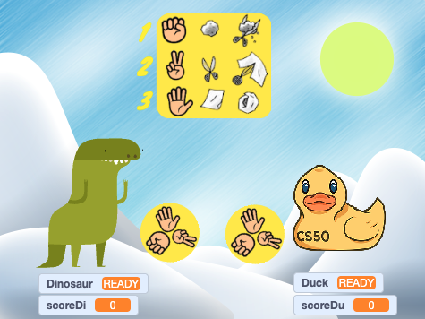

<h1 align="center"> RpS no Scratch </h1>

Program developed during the cs50 course.  
<a href="https://cs50.harvard.edu/x/2024/" target="_blank">Visit this course.</a>

  <a href="#-technologies">Technologies</a>&nbsp;&nbsp;&nbsp;|&nbsp;&nbsp;&nbsp;
  <a href="#-project">Project</a>&nbsp;&nbsp;&nbsp;|&nbsp;&nbsp;&nbsp;
  <a href="#-game">Game</a>&nbsp;&nbsp;&nbsp;|&nbsp;&nbsp;&nbsp;
  <a href="#memo-license">License</a>

  

 

  

## 🚀 Technologies

This project was developed with the following technologies:

- Scratch
- Programming logic
- Canva
- Git and Github

## 💻 Project

The game RpS (Rock Paper Scissors) was developed using the Scratch programming language and simulates a game known as Jokenpo.

On the platform it is possible to use several code and costume options.

The logic for choosing the hand by the user (duck) and by the computer (dinosaur) was implemented;

The symbol with the three hand options was moved when starting the game;

The game scoreboard was created, indicating the user's and computer's points.

[Access the finished project online.](https://scratch.mit.edu/projects/1028059214/)

## 🔖 Game

Instructions:

User = Duck
Computer = Dinosaur

1. Click on the green flag to start the game;
2. Click on the red ball to stop the game;
3. Use keys 1, 2 or 3 to choose between rock, scissors or paper.
4. Score according to the rules on the screen.

## :memo: License

This project is under the MIT license.

---

Made with ☕️ by BrunnoML.
